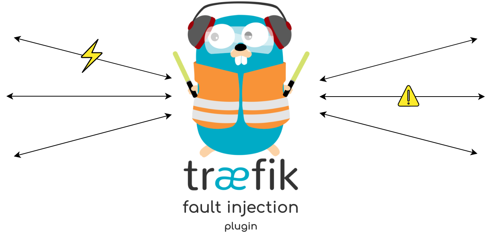

  

# Traefik Fault Injection

This plugin can be used to test the resiliency of microservices to different forms of failures.

Inspired by the [Envoy Fault Injection filter](https://www.envoyproxy.io/docs/envoy/latest/configuration/http/http_filters/fault_filter).

## Docs

Currently supported header controls:

**x-traefik-fault-delay-request**

The duration to delay a request by. The header value should be an integer that specifies the number of milliseconds to throttle the latency for.

> With **x-traefik-fault-delay-request-percentage** you can specify the percentage of requests that should be affected (value: 0-100)

**x-traefik-fault-abort-request**

HTTP status code to abort a request with. The header value should be an integer that specifies the HTTP status code to return in response to a request.

> With **x-traefik-fault-abort-request-percentage** you can specify the percentage of requests that should be affected (value: 0-100)

### Plugin options

**Delay**

*Default: true*

This determines if the delay failure is enabled.

**DelayDuration**

*Default: 0*

The number of number of milliseconds to throttle the latency for.

**DelayPercentage**

*Default: 100*

The percentage of requests that should be delayed.

**Abort**

*Default: false*

This determines if the abort failure is enabled.

**AbortCode**

*Default: 400*

The HTTP status code to return.

**AbortPercentage**

*Default: 100*

The percentage of requests that should be failed.