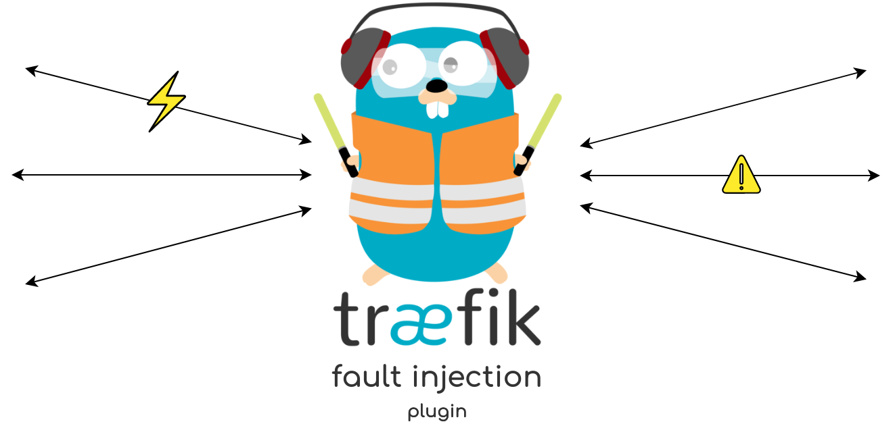

  

# Traefik Fault Injection

This plugin can be used to test the resiliency of microservices to different forms of failures.

Inspired by the [Envoy Fault Injection filter](https://www.envoyproxy.io/docs/envoy/latest/configuration/http/http_filters/fault_filter).

## Installation

You're on Github:
- Go to [Fault Injection](https://pilot.traefik.io/plugins/279918789803378185/fault-injection) on Traefik Pilot and click the `Install Plugin` button.

You're on Traefik Pilot:
- Click the `Install Plugin` button.

## Header options

Currently supported header controls:

**x-traefik-fault-delay-request**

The duration to delay a request by. The header value should be an integer that specifies the number of milliseconds to throttle the latency for. This header depends on the `Delay` plugin option.

> With **x-traefik-fault-delay-request-percentage** you can specify the percentage of requests that should be affected (value: 0-100)

**x-traefik-fault-abort-request**

HTTP status code to abort a request with. The header value should be an integer that specifies the HTTP status code to return in response to a request. This header depends on the `Abort` plugin option.

> With **x-traefik-fault-abort-request-percentage** you can specify the percentage of requests that should be affected (value: 0-100)

### Plugin options

**Delay**

*Default: true*

This determines if the delay failure is enabled.

**DelayDuration**

*Default: 0*

The number of milliseconds to throttle the latency for.

**DelayPercentage**

*Default: 100*

The percentage of requests that should be delayed.

**Abort**

*Default: false*

This determines if the abort failure is enabled.

**AbortCode**

*Default: 400*

The HTTP status code to return.

**AbortPercentage**

*Default: 100*

The percentage of requests that should be failed.

## How to contribute
1. Check for open issues or open a fresh issue to start a discussion around a feature idea or a bug.
2. Fork [the repository](https://github.com/dgzlopes/traefik-fault-injection) on GitHub to start making your changes to the master branch (or branch off of it).
3. Write a test that shows that the bug was fixed or that the feature works as expected.
4. Send a [pull request](https://help.github.com/en/articles/creating-a-pull-request-from-a-fork) and bug [me](https://github.com/dgzlopes) until it gets merged and published.